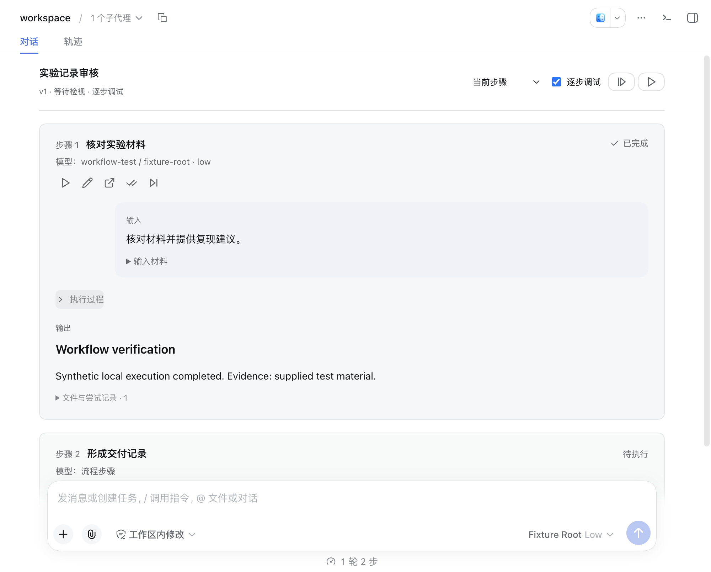
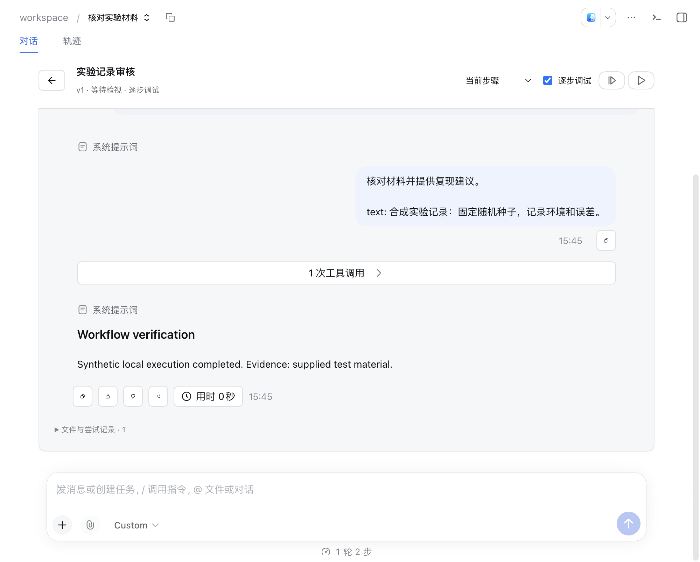
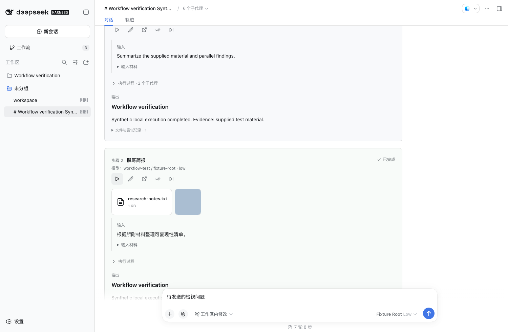
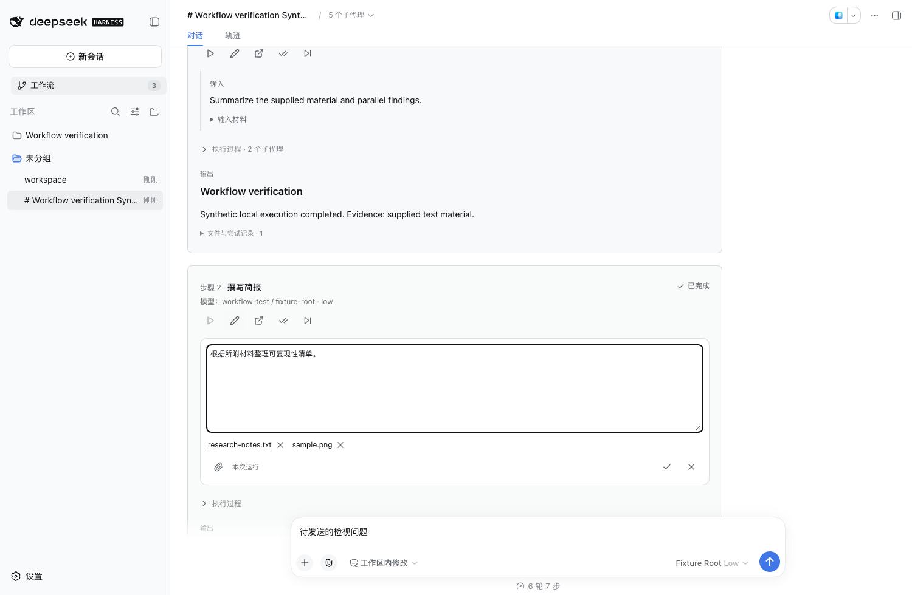
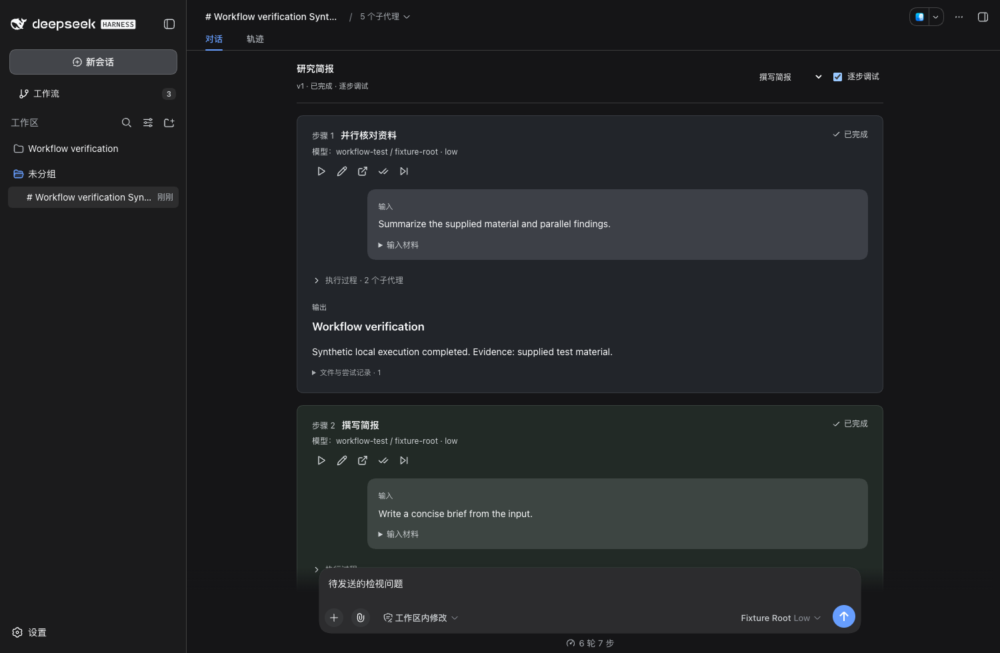
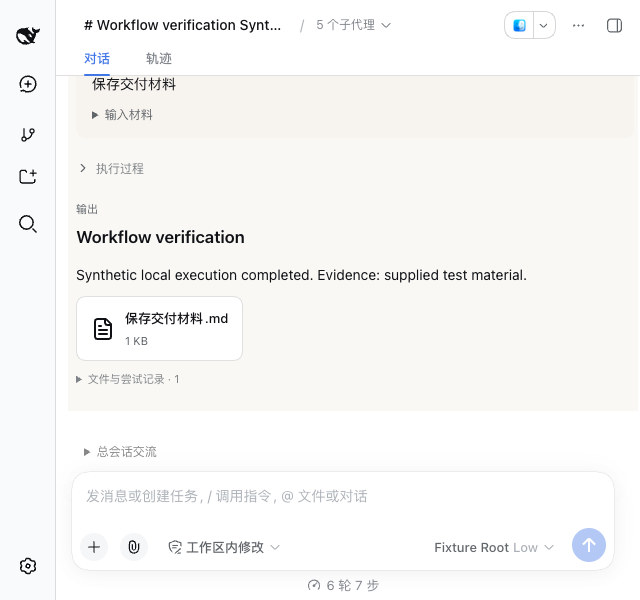

# Workflow 0.3.0 验收报告

2026-09-18。**核心对话与调试路径通过，完整产品验收尚未通过。** 本报告分别记录通过、部分覆盖、待测和未满足项，不把测试清单数量当作通过数量。

## 环境与结果

- macOS arm64、Node 24.11.1、Harness 0.1.5-rc.2；独立 DSH home、合成项目和本地合成 provider。
- 单元测试 38 / 38 通过：版本冲突、图依赖、交互、权限、调试、文件回退、二进制与权限恢复、未完成事务恢复。
- 原有 Web 全链路回归通过；新增 24 个行为场景通过，见 [Web 原始结果](acceptance/web/results.json)。
- 安装的 DSH Desktop 使用独立 user-data 测试；首次主路径通过，后续发现兼容模式内容区空白，整体验收未通过。见 [Desktop 原始结果](acceptance/desktop/results.json)。桌面测试实际执行 Agent、工具、持久会话和原生组件。
- 未使用外部真实模型，不评价模型回答质量；未对所有操作系统、执行器和长时间压力场景作出结论。
- 原始测试清单包含 [104 项验收条目](workflow-acceptance-plan.md)，下方逐条记录覆盖情况。

## 当前 Desktop 布局复核

在已安装的 Desktop 中复核了原生欢迎页、左对齐的会话列表、编辑器中的逐步调试选项与单层多行输入框。1024 像素窗口下工具栏自动换行，按钮文字保持横向。节点组件使用稳定定义；重启后首次进入研究简报编辑器，三个步骤与连线可见。此项不替代下方兼容模式生命周期问题的验收。

## 对话与布局证据

步骤正文左对齐显示，低饱和度背景区分步骤，顶部图标工具栏提供单步运行与输入编辑。输入使用气泡和附件卡片，最终结论直接展示，执行过程缩进折叠。当前步骤位于运行页顶，逐步调试在工作流编辑器中选择。



步骤可以在主界面独立打开，补聊后返回总会话；采用输出是单独操作。



输入编辑保存到本次运行，附件以卡片显示，并通过持久化附件块传入真实子会话。





应用主题切换后，摘要与控件沿用对应主题；测试同时检查未发送草稿保留。



窗口宽度覆盖 1600、1280、900、640 像素，检查时间线横向溢出。



[工作流演示 GIF](../assets/workflow-conversation.gif) 是真实界面状态采样，展示步骤、输入编辑与附件。

## 已确认的行为

调试每次推进一个就绪节点，节点内成员并行；完成的输入、输出、模型和尝试记录持久化。步骤可继续交流，补聊不会自动替换有效输出。采用输出、回退与恢复使用运行锁和版本检查。回退先检查整个事务涉及的文件，外部修改冲突会停止操作。文本 patch 已通过 `git apply` 实际验证；二进制和权限通过精确 patch 恢复。

运行中向指定子代理发送补充消息、刷新页面并继续等待，最终仍是同一次暂停运行。步骤往返十次、重复面板开关、连续刷新五次和三种主题切换有独立行为断言。

## 未满足项与风险

| 编号 | 优先级 | 验收缺口 |
| --- | --- | --- |
| WF-00 | P1 | 兼容模式测试窗口在生命周期测试后的复测中出现空白内容区；Host 可响应，运行数据保留，确切触发机制与窗口恢复尚未验证。 |
| WF-01 | P1 | 多个子代理直接修改同一公共文件，缺少过程级写入冲突仲裁；快照只能保存步骤前后最终状态。 |
| WF-02 | P2 | 步骤输入编辑可上传文件并重跑；运行中的直接补充附件仍受宿主 prompt 接口约束，尚未支持。 |
| WF-03 | P2 | 旧尝试目录保留，但旧会话尚无专门的历史尝试切换入口。 |
| WF-04 | P2 | 外部一次性执行器的继续交流能力差异提示未完善。 |
| WF-05 | P2 | 实际滚轮双向滚动通过；触控板惯性、超长输出及折叠后的精确阅读锚点仍待专项验证。 |
| WF-06 | P2 | 网络请求、部署和公共目录外文件变化不在快照回退范围内。 |

嵌入原生步骤视图使用版本固定适配层；升级 Harness 必须重新验证 slot、历史加载和父子会话地址。快照上限为 128 MiB / 20,000 个常规文件，排除符号链接、`.git`、`node_modules` 和内部检查点。磁盘不足、网络盘、极大项目和 OS 强制中断仍需专项测试。

## 隐私检查

- 插件当前文件和全部可达 Git 历史经过凭据、私钥、带凭据 URL、个人路径扫描。扫描结果只输出位置和类别。
- Bundle 的 9 个历史提交、295 个唯一历史 blob 和当前树完成扫描；命中项为 browser 测试中的虚构 example.com 用户密码 URL，人工核对为测试数据。
- Web 请求观测仅出现隔离的本机 origin，见 [网络结果](acceptance/web/network.json)。实际使用时，任务材料会发送到用户配置的模型 provider。
- Desktop 截图仅保留工作流内容区域。验收截图和 GIF 发布帧经过 OCR 隐私规则检查；GIF 帧和关键截图已视觉复核。OCR 是辅助检查，不能证明不存在所有形式的隐私内容。
- 用户参考截图、真实项目材料、运行数据库、快照及本机配置不属于发布文件。

## 复现

```sh
npm ci
npm test
npm run build
npm run check:host
npm run check:web
npm run check:acceptance
npm run check:privacy
```

Desktop 测试先准备独立 user-data、DSH home 和合成 provider，确认 profile 实际安装本版本，再设置 `WORKFLOW_CDP_PORT` 运行 `npm run check:desktop`。UI 脚本依赖相邻 browser 插件的 Playwright 和 bundle QA driver。


## 逐项验收结果

状态仅适用于记录的证据范围。单元、Web 与 Desktop 分别判断；部分覆盖和待测不计为通过。

| ID | 场景 | 状态 | 证据范围 |
| --- | --- | --- | --- |
| C01 | 从侧栏创建 | 部分覆盖 | 有部分自动化证据，完整端到端条件待专项验证。 |
| C02 | 从会话命令创建 | 待测 | 尚无直接执行证据。 |
| C03 | 连续创建三个工作流 | 部分覆盖 | 有部分自动化证据，完整端到端条件待专项验证。 |
| C04 | 同名工作流 | 待测 | 尚无直接执行证据。 |
| C05 | 空名称、空提示词、纯空格 | 部分覆盖 | 有部分自动化证据，完整端到端条件待专项验证。 |
| C06 | 中文、表情、换行、超长名称 | 待测 | 尚无直接执行证据。 |
| C07 | 拷贝工作流 | 通过 | 见 test/debug.test.js、test/core.test.js、Web / Desktop 交互结果及截图。 |
| C08 | 编辑后保存与重开 | 通过 | 见 test/debug.test.js、test/core.test.js、Web / Desktop 交互结果及截图。 |
| C09 | 两个视图同时编辑 | 通过 | 见 test/debug.test.js、test/core.test.js、Web / Desktop 交互结果及截图。 |
| C10 | 删除有引用的步骤 | 待测 | 尚无直接执行证据。 |
| C11 | 环路、自连接、悬空映射 | 通过 | 见 test/debug.test.js、test/core.test.js、Web / Desktop 交互结果及截图。 |
| C12 | 归档、隐藏、重新打开 | 待测 | 尚无直接执行证据。 |
| R01 | 首条消息启动 | 待测 | 尚无直接执行证据。 |
| R02 | 连续点击运行 | 通过 | 见 test/debug.test.js、test/core.test.js、Web / Desktop 交互结果及截图。 |
| R03 | 当前步骤执行中发消息 | 通过 | 见 test/debug.test.js、test/core.test.js、Web / Desktop 交互结果及截图。 |
| R04 | 连发多条消息 | 待测 | 尚无直接执行证据。 |
| R05 | 运行中上传材料 | 未满足 | 见上方未满足项。 |
| R06 | 运行中停止 | 部分覆盖 | 有部分自动化证据，完整端到端条件待专项验证。 |
| R07 | 暂停后恢复 | 通过 | 见 test/debug.test.js、test/core.test.js、Web / Desktop 交互结果及截图。 |
| R08 | 完成边界同时发消息 | 待测 | 尚无直接执行证据。 |
| R09 | 多个 workflow 同时运行 | 部分覆盖 | 有部分自动化证据，完整端到端条件待专项验证。 |
| R10 | 交互节点等待与回答 | 通过 | 见 test/debug.test.js、test/core.test.js、Web / Desktop 交互结果及截图。 |
| R11 | 确认节点批准与拒绝 | 通过 | 见 test/debug.test.js、test/core.test.js、Web / Desktop 交互结果及截图。 |
| R12 | 运行期间修改定义 | 通过 | 见 test/debug.test.js、test/core.test.js、Web / Desktop 交互结果及截图。 |
| R13 | 模型超时、断流与错误 | 部分覆盖 | 有部分自动化证据，完整端到端条件待专项验证。 |
| R14 | 输出 Schema 不匹配 | 通过 | 见 test/debug.test.js、test/core.test.js、Web / Desktop 交互结果及截图。 |
| R15 | 主会话与步骤模型不同 | 通过 | 见 test/debug.test.js、test/core.test.js、Web / Desktop 交互结果及截图。 |
| R16 | 无模型配置或模型失效 | 待测 | 尚无直接执行证据。 |
| D01 | 调试启动 | 通过 | 见 test/debug.test.js、test/core.test.js、Web / Desktop 交互结果及截图。 |
| D02 | 连续单步直到结束 | 通过 | 见 test/debug.test.js、test/core.test.js、Web / Desktop 交互结果及截图。 |
| D03 | 单步双击与并发请求 | 通过 | 见 test/debug.test.js、test/core.test.js、Web / Desktop 交互结果及截图。 |
| D04 | 用户检视后继续 | 通过 | 见 test/debug.test.js、test/core.test.js、Web / Desktop 交互结果及截图。 |
| D05 | agent 检视后继续 | 待测 | 尚无直接执行证据。 |
| D06 | 从给定步骤重跑 | 通过 | 见 test/debug.test.js、test/core.test.js、Web / Desktop 交互结果及截图。 |
| D07 | 从下一步继续 | 通过 | 见 test/debug.test.js、test/core.test.js、Web / Desktop 交互结果及截图。 |
| D08 | 分支单步与汇合 | 通过 | 见 test/debug.test.js、test/core.test.js、Web / Desktop 交互结果及截图。 |
| D09 | 最后一步完成 | 通过 | 见 test/debug.test.js、test/core.test.js、Web / Desktop 交互结果及截图。 |
| D10 | 首步失败后恢复 | 部分覆盖 | 有部分自动化证据，完整端到端条件待专项验证。 |
| D11 | 已完成步骤补聊 | 通过 | 见 test/debug.test.js、test/core.test.js、Web / Desktop 交互结果及截图。 |
| D12 | 更新输出后重跑 | 通过 | 见 test/debug.test.js、test/core.test.js、Web / Desktop 交互结果及截图。 |
| D13 | 补聊仍在执行时继续 workflow | 部分覆盖 | 有部分自动化证据，完整端到端条件待专项验证。 |
| D14 | 输出采用与恢复同时请求 | 通过 | 见 test/debug.test.js、test/core.test.js、Web / Desktop 交互结果及截图。 |
| D15 | 嵌套 workflow 与循环 | 部分覆盖 | 有部分自动化证据，完整端到端条件待专项验证。 |
| D16 | 刷新后继续调试 | 通过 | 见 test/debug.test.js、test/core.test.js、Web / Desktop 交互结果及截图。 |
| S01 | 在主界面打开步骤 | 通过 | 见 test/debug.test.js、test/core.test.js、Web / Desktop 交互结果及截图。 |
| S02 | 步骤会话继续交流 | 通过 | 见 test/debug.test.js、test/core.test.js、Web / Desktop 交互结果及截图。 |
| S03 | 返回 workflow 总会话 | 通过 | 见 test/debug.test.js、test/core.test.js、Web / Desktop 交互结果及截图。 |
| S04 | 往返切换十次 | 通过 | 见 test/debug.test.js、test/core.test.js、Web / Desktop 交互结果及截图。 |
| S05 | 重启后打开步骤 | 待测 | 尚无直接执行证据。 |
| S06 | 查看旧执行尝试 | 未满足 | 见上方未满足项。 |
| S07 | 同步启动多个 subagents | 部分覆盖 | 有部分自动化证据，完整端到端条件待专项验证。 |
| S08 | 子代理配置不同模型 | 通过 | 见 test/debug.test.js、test/core.test.js、Web / Desktop 交互结果及截图。 |
| S09 | 子代理分别返回结果 | 通过 | 见 test/debug.test.js、test/core.test.js、Web / Desktop 交互结果及截图。 |
| S10 | 子代理失败、其他仍运行 | 待测 | 尚无直接执行证据。 |
| S11 | 向指定子代理发消息 | 通过 | 见 test/debug.test.js、test/core.test.js、Web / Desktop 交互结果及截图。 |
| S12 | 父步骤停止 | 部分覆盖 | 有部分自动化证据，完整端到端条件待专项验证。 |
| S13 | 子代理内继续委派 | 待测 | 尚无直接执行证据。 |
| S14 | 外部执行器无原生会话 | 未满足 | 见上方未满足项。 |
| F01 | 每步生成产物 | 通过 | 见 test/debug.test.js、test/core.test.js、Web / Desktop 交互结果及截图。 |
| F02 | 修改、新增、删除公共文件 | 通过 | 见 test/debug.test.js、test/core.test.js、Web / Desktop 交互结果及截图。 |
| F03 | 单步回退再运行 | 通过 | 见 test/debug.test.js、test/core.test.js、Web / Desktop 交互结果及截图。 |
| F04 | 回退多个依赖步骤 | 通过 | 见 test/debug.test.js、test/core.test.js、Web / Desktop 交互结果及截图。 |
| F05 | 用户在运行外修改文件 | 通过 | 见 test/debug.test.js、test/core.test.js、Web / Desktop 交互结果及截图。 |
| F06 | 并行子代理修改同一文件 | 未满足 | 见上方未满足项。 |
| F07 | 二进制、大文件、文件权限 | 部分覆盖 | 有部分自动化证据，完整端到端条件待专项验证。 |
| F08 | 路径穿越与符号链接 | 通过 | 见 test/debug.test.js、test/core.test.js、Web / Desktop 交互结果及截图。 |
| F09 | 磁盘不足、只读目录 | 待测 | 尚无直接执行证据。 |
| F10 | 应用中断后重启 | 部分覆盖 | 有部分自动化证据，完整端到端条件待专项验证。 |
| F11 | 重复回退与重复应用 | 通过 | 见 test/debug.test.js、test/core.test.js、Web / Desktop 交互结果及截图。 |
| F12 | Git 工作区含未提交修改 | 部分覆盖 | 有部分自动化证据，完整端到端条件待专项验证。 |
| F13 | 非 Git 工作区 | 通过 | 见 test/debug.test.js、test/core.test.js、Web / Desktop 交互结果及截图。 |
| F14 | 网络请求、部署等外部副作用 | 待测 | 尚无直接执行证据。 |
| U01 | 浅色、深色、系统主题 | 通过 | 见 test/debug.test.js、test/core.test.js、Web / Desktop 交互结果及截图。 |
| U02 | 运行中反复切换主题 | 通过 | 见 test/debug.test.js、test/core.test.js、Web / Desktop 交互结果及截图。 |
| U03 | 步骤推进 | 通过 | 见 test/debug.test.js、test/core.test.js、Web / Desktop 交互结果及截图。 |
| U04 | 展开历史步骤 | 通过 | 见 test/debug.test.js、test/core.test.js、Web / Desktop 交互结果及截图。 |
| U05 | 步骤摘要 | 通过 | 见 test/debug.test.js、test/core.test.js、Web / Desktop 交互结果及截图。 |
| U06 | 超长输出、代码、表格 | 待测 | 尚无直接执行证据。 |
| U07 | 窗口 1600×1000、1280×800、900×600 | 通过 | 见 test/debug.test.js、test/core.test.js、Web / Desktop 交互结果及截图。 |
| U08 | 窄窗口与 200% 缩放 | 待测 | 尚无直接执行证据。 |
| U09 | 键盘导航与 Escape | 部分覆盖 | 有部分自动化证据，完整端到端条件待专项验证。 |
| U10 | 加载、空态、断线与失败态 | 部分覆盖 | 有部分自动化证据，完整端到端条件待专项验证。 |
| U11 | 用户向上阅读时收到新轨迹 | 未满足 | 见上方未满足项。 |
| U12 | 多子代理轨迹同时更新 | 待测 | 尚无直接执行证据。 |
| L01 | 关闭面板、重开 | 通过 | 见 test/debug.test.js、test/core.test.js、Web / Desktop 交互结果及截图。 |
| L02 | 隐藏窗口、最小化、切换应用 | 待测 | 尚无直接执行证据。 |
| L03 | 关闭窗口后从 Dock 重开 | 待测 | 尚无直接执行证据。 |
| L04 | 完全退出、重新启动 | 部分覆盖 | 有部分自动化证据，完整端到端条件待专项验证。 |
| L05 | 强制结束 Host | 部分覆盖 | 有部分自动化证据，完整端到端条件待专项验证。 |
| L06 | 连续刷新五次 | 通过 | 见 test/debug.test.js、test/core.test.js、Web / Desktop 交互结果及截图。 |
| L07 | 前后导航、快速切换多个工作流 | 待测 | 尚无直接执行证据。 |
| L08 | 断开后端连接并恢复 | 待测 | 尚无直接执行证据。 |
| L09 | 执行中归档或解除绑定 | 待测 | 尚无直接执行证据。 |
| L10 | 持续运行与重复开关 | 待测 | 尚无直接执行证据。 |
| P01 | 待提交文本扫描 | 通过 | 见 test/debug.test.js、test/core.test.js、Web / Desktop 交互结果及截图。 |
| P02 | Git 已追踪内容与历史扫描 | 通过 | 见 test/debug.test.js、test/core.test.js、Web / Desktop 交互结果及截图。 |
| P03 | 配置、日志、SQLite 与产物 | 通过 | 见 test/debug.test.js、test/core.test.js、Web / Desktop 交互结果及截图。 |
| P04 | 截图人工检查 | 通过 | 见 test/debug.test.js、test/core.test.js、Web / Desktop 交互结果及截图。 |
| P05 | GIF 逐帧检查 | 通过 | 见 test/debug.test.js、test/core.test.js、Web / Desktop 交互结果及截图。 |
| P06 | 网络与遥测检查 | 通过 | 见 test/debug.test.js、test/core.test.js、Web / Desktop 交互结果及截图。 |
| P07 | 插件仓库发布树 | 待测 | 尚无直接执行证据。 |
| P08 | bundle 固定提交与 vendor 内容 | 待测 | 尚无直接执行证据。 |
| P09 | README GIF 和报告链接 | 通过 | 见 test/debug.test.js、test/core.test.js、Web / Desktop 交互结果及截图。 |
| P10 | 最终验收报告 | 待测 | 尚无直接执行证据。 |


## Notebook 专项记录

| ID | 实际操作与断言 | 结果 |
| --- | --- | --- |
| N01 | 总会话修改 prompt，选择文件和图片，保存并运行；模板保持原值，子会话事件包含真实附件，下游结果过期 | 通过 |
| N02 | 独立步骤页修改 prompt、保存、返回总会话，核对同一运行中的修改 | 通过 |
| N03 | 展开真实原生过程，鼠标悬停在步骤内，向下滚动 320 像素后反向滚动 260 像素；核对外层 scrollTop 双向变化 | 通过 |
| N04 | 陈旧 revision 保存、伪造已有附件 id 和跨范围文件下载请求 | 拒绝符合预期 |
| N05 | 单元测试确认 run override 到达 executor，模板版本不变 | 通过 |
| N06 | 单元测试确认上游文件通过依赖边继承并按内容 id 去重 | 通过 |

滚动容器采用单一页面所有权。嵌入步骤的会话适配层保留本地无滚动范围的边界，原生自动跟随不会修改外层页面位置。视觉测试覆盖浅色、深色、系统主题及 640–1600 像素窗口；截图仅代表所列尺寸。

N07：公共目录中新生成的文件保存为输出附件并传给下游，单元测试通过。

初始化与打开工作流面板会主动刷新数据，即使渲染器报告为隐藏状态。该修复覆盖面板空列表这一独立问题，不能据此认定兼容模式空白屏已修复。

U12：编辑器调试设置持久化，后续绑定继承设置；未开始运行的绑定同步更新。运行页面不显示调试选项。
