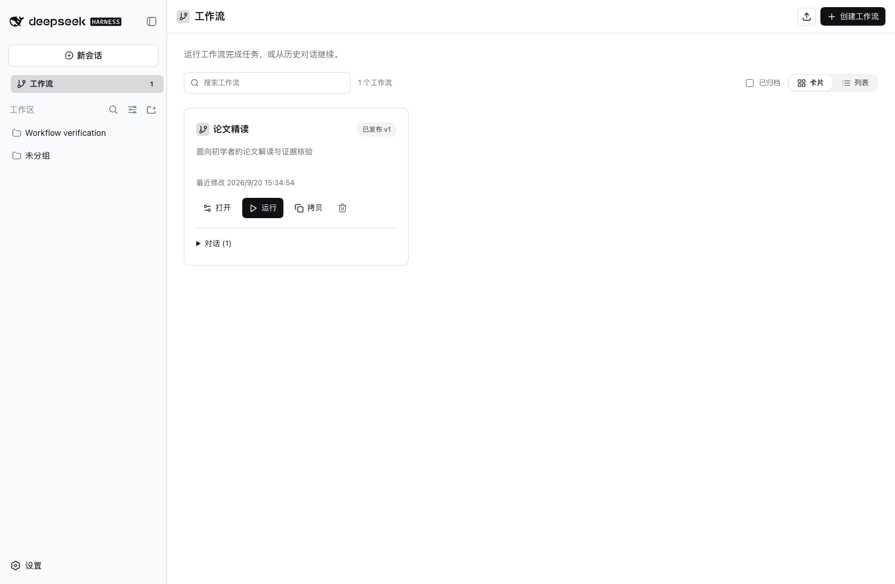
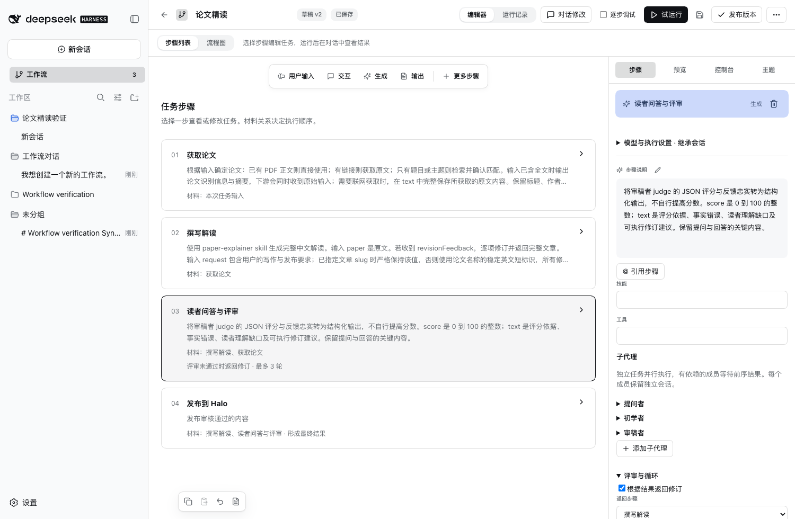
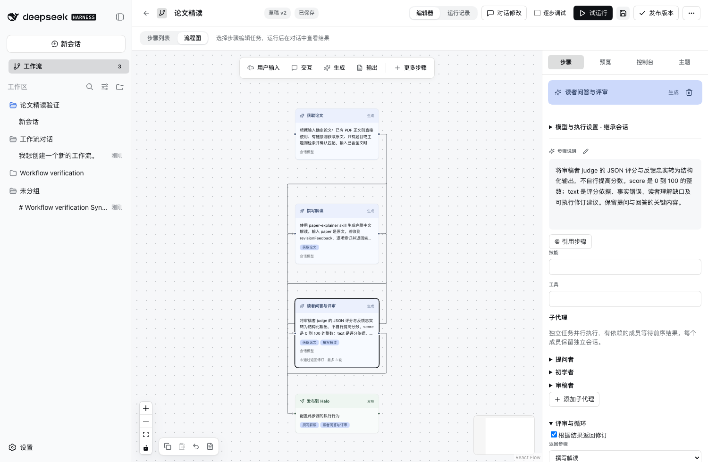
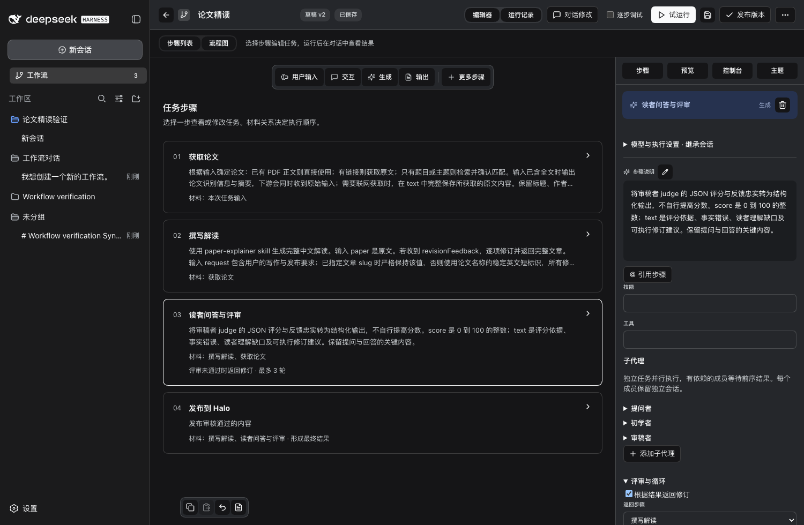
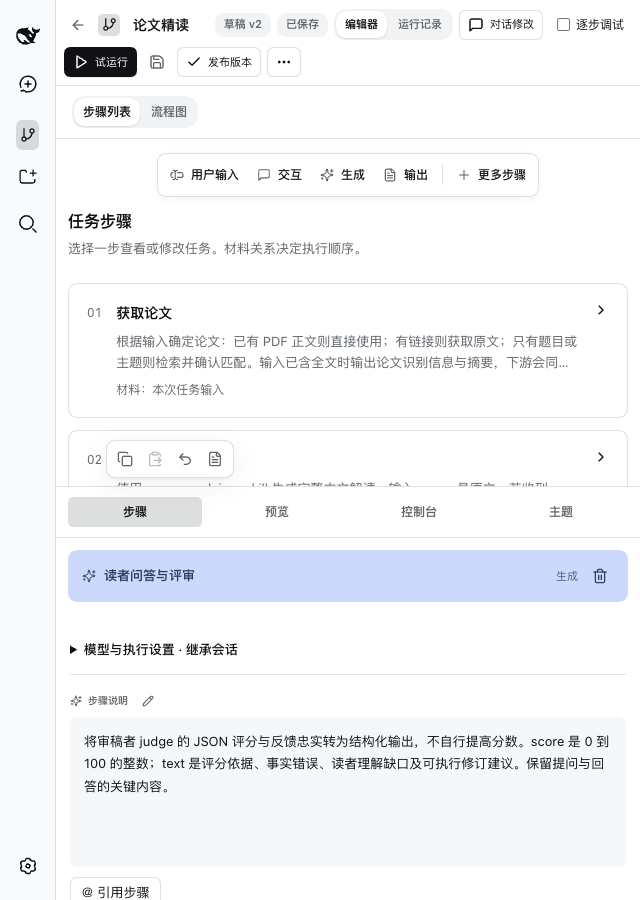

# Desktop 工作流体验验收

日期：2026-09-20。范围：Desktop 工作流总览、编辑器、历史入口及执行会话。构建已在当前 Desktop 加载，源代码与集成 bundle 保持本地同步。

[调研、设计取舍与界面约定](desktop-ux-research.md)

## 本轮结果

| 验收项 | 结果与证据 |
| --- | --- |
| 首次进入默认步骤列表 | 当前 Desktop 实机通过，论文精读显示四个步骤 |
| 选择步骤联动配置 | 当前 Desktop 点击“撰写解读”，右侧说明与 skill 更新 |
| 步骤列表与流程图切换 | Web Host 通过，共用定义，草稿保留 |
| 更多步骤添加工具及撤销 | Web Host 通过，节点数量恢复 |
| 搜索空状态及清除恢复 | Web Host 通过 |
| 历史打开、续聊、刷新重入 | Web Host 通过，同一会话和运行记录 |
| 卡片与列表切换、复制工作流 | Web Host 通过 |
| 创建会话与对话修改入口 | Web Host 通过 |
| 模型路由与输入交互 | Web Host 通过 |
| 单步、继续、步骤续聊、采用输出、回退、子代理 | 24 个行为场景通过，详见原始结果 |
| 浅色、深色、系统主题 | 场景通过，截图人工查看 |
| 主按钮对比度 | 浅色、深色计算对比度均达到 4.5:1 |
| 窄窗口 | 640px 编辑器与 390px 运行记录通过横向溢出检查；截图已检查 |
| 原生宽度拖拽条与步骤按钮 | 工作流页面关闭原生宽度拖拽区域，点击回归通过 |
| 单元回归 | 50 项通过 |
| 隐私扫描 | 84 个文件、7 个历史修订、117 个历史对象无匹配项；公开截图仅含合成数据 |

完整行为场景结果：[results.json](acceptance/web/results.json)。交互脚本：scripts/web-check.mjs、scripts/acceptance-scenarios.mjs。

## 界面截图

### 工作流总览

### 步骤列表与配置

### 流程图

### 深色主题

### 窄窗口

截图来自与 Desktop 共用构建的隔离 Host，使用合成数据。实际 Desktop 原生窗口已检查总览、默认步骤列表与配置联动；其私人侧边栏内容不纳入仓库截图。

## 证据边界

本轮没有招募真实新用户，尚不能量化完成时间、学习成本或满意度的提升。完整读屏软件测试、所有系统缩放档位、跨操作系统窗口生命周期不在本轮已验证范围。截图导览是静态界面序列，不代表实时执行录像。隐私扫描为规则检查和图像人工检查，不构成绝对无泄漏保证。
