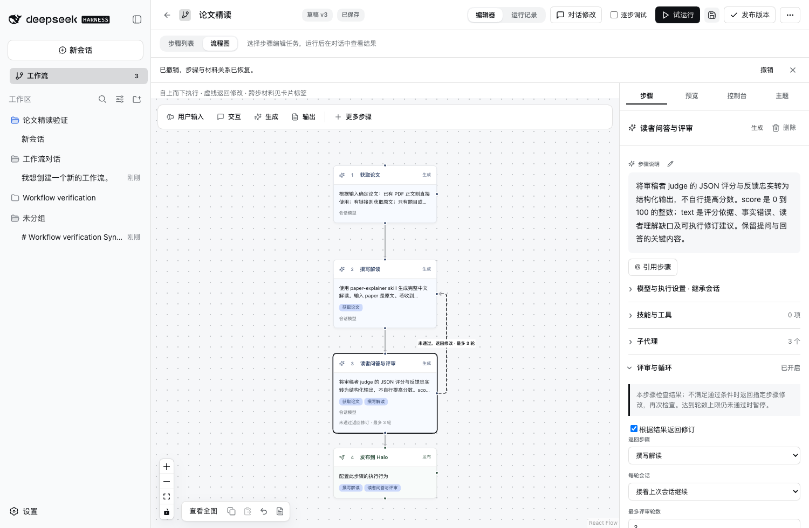

# 流程图与 Skill 编辑验收

2026-09-20

流程图按依赖从上到下排列，模块带序号。主线省略可由其他主线推导出的传递依赖，跨步骤材料仍显示在模块标签中，执行定义保持完整。循环使用独立虚线和“未通过，返回修改”标签。画布采用自动布局。

“更多步骤”使用原生 dialog 展示选项，支持 Escape 关闭。侧栏折叠项将标题、数量与开关状态放在同一行；评审配置包含含义、轮数上限与暂停行为说明。

在“技能与工具”中点击“编辑 skill名称”可编辑全文，应用后成为当前步骤的专用内容；保存工作流版本后，后续执行使用该版本快照。其他工作流的共享 skill 保持原内容。已有运行继续使用启动时的快照。

## 验证结果

- 51 项单元测试通过，包括专用 skill 内容进入执行快照、哈希更新及共享内容保留。
- 原生 Host Web 检查通过，包括读取 skill、编辑全文、保存工作流后回读一致。
- 更多步骤弹窗打开、选择工具、添加及撤销通过。
- 循环连线存在、步骤视图切换、历史续聊及刷新恢复通过。
- 明暗主题及窄窗口截图已生成。实际大型分支流程和读屏软件尚未全面测试。

截图为隔离环境合成测试，私人 Desktop 会话未写入仓库。
