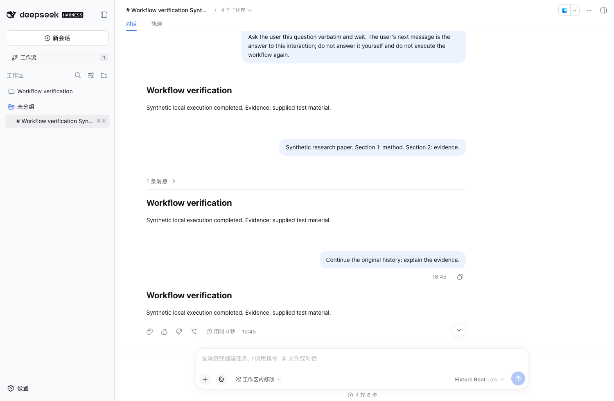

# 工作流历史对话验收

日期：2026-09-20

工作流的「对话」保存已使用会话的入口。选择条目打开原会话，沿用消息与运行记录；用户可以在原输入框继续交流。

| 测试项 | 结果 |
| --- | --- |
| 未发送消息、未执行的绑定不计入历史 | 通过 |
| 已有消息的会话保留原 ID | 通过 |
| 有执行记录的会话可进入历史 | 通过 |
| 超出最近 100 次运行仍保留历史资格 | 单元测试通过 |
| 已归档、已不存在、其他工作流的会话被排除 | 通过 |
| 卡片数量与历史列表一致 | 通过 |
| 连续两次点击历史条目可打开原会话 | Web 验证通过 |
| 原消息可见，输入框发送后仍在同一会话 | Web 验证通过 |
| 普通续聊不额外创建工作流运行 | Web 验证通过 |
| 页面刷新后再次打开保留续聊消息 | Web 验证通过 |
| 当前 Desktop 打开研究简报 hello 历史 | 通过：显示 9 月 18 日原消息与回复，输入框可用 |

自动化：50 项单元测试通过；原生 Host Web 综合检查通过。续聊使用隔离环境的合成模型。当前 Desktop 验证了既有真实会话的打开和内容显示，未向用户历史写入测试消息。

当前 Desktop 的论文精读有两个空绑定、没有对应运行记录，列表显示 0 个历史对话。数据保留。FreeToken 验收运行在独立测试环境，不属于当前 Desktop 的历史。

截图仅含合成测试数据，已经人工检查。

