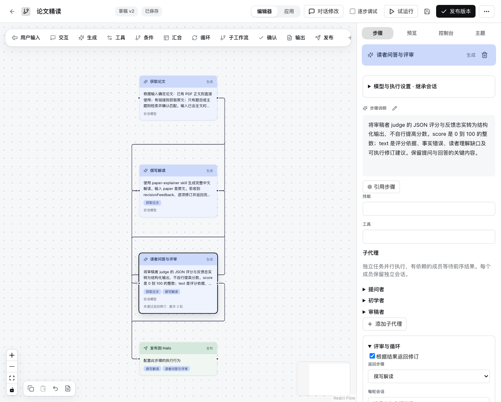
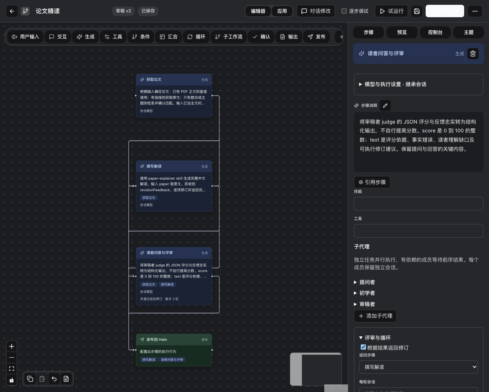
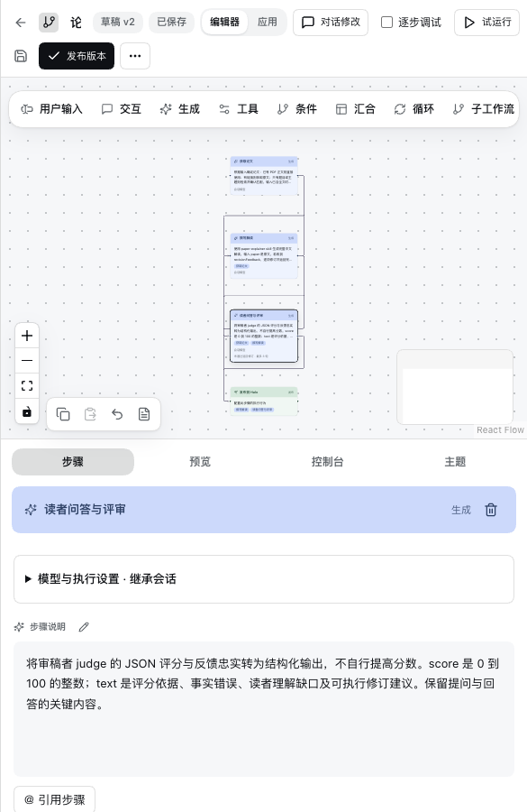

# 论文工作流验收记录

日期：2026-09-20。环境：macOS、Node 24.11.1、Harness 0.1.5-rc.2、DSH Desktop 2.0.10。

## 验收范围

四个阶段：获取论文、生成分层解读、三个成员按依赖问答与评分、发布到 Halo。评分门槛 85，最多三轮。循环支持新会话与延续原会话。插件和 Desktop bundle 使用相同实现。

本报告将自动化合成回归、真实模型运行、服务器发布和当前 Desktop 操作分别记录。模型分数不等同于真实读者评价，测试通过不证明文章中每个事实均正确。

单元测试 48 / 48 通过，Host 检查、Web 主路径和 24 个行为回归场景通过。

## 功能与行为测试

| 编号 | 测试操作与期望 | 结果 | 证据 |
| --- | --- | --- | --- |
| P01 | 创建四阶段模板，校验依赖、输入映射和输出 schema | 通过 | 单元测试、Host 加载检查 |
| P02 | 提问结束后才启动回答，回答结束后启动审稿 | 通过（合成） | paper.test.js、debug.test.js |
| P03 | 回答者仅收到文章和问题，原文标记不出现在输入 | 通过（合成） | 独立输入断言 |
| P04 | 无依赖成员并行；拒绝循环依赖和非上游引用 | 通过（合成） | 图与成员依赖测试 |
| P05 | 评分不足返回写作；第二轮达标才发布，发布一次 | 通过（合成） | 四阶段完整执行测试 |
| P06 | 新会话循环生成独立会话；延续模式排队进入既有会话 | 通过（适配器单元测试） | continuation 测试；真实循环另行记录 |
| P07 | 三轮不足停止，普通继续无法绕过门槛 | 通过（合成） | REVIEW_LIMIT 测试 |
| P08 | 调试一次推进一个就绪步骤，团队内部按依赖完成 | 通过（合成） | 调试边界测试 |
| P09 | 每轮文章写入 Markdown，保存输入、输出及尝试 | 通过（合成） | artifact 内容与数量断言 |
| P10 | 更新原文章时拒绝 slug 或文章标识不匹配 | 通过（本地校验） | publisher.test.js；服务端再核验 |
| P11 | 低于门槛不发起发布连接 | 通过 | publisher.test.js |
| P12 | 空工具白名单也禁止宿主额外注册的委派工具 | 通过（执行守卫单元测试） | session-owned 工具拒绝断言 |
| P13 | 单一 JSON 代码块可解析；多个候选块被拒绝 | 通过 | 结构化输出边界测试 |
| P14 | 创建、多个工作流、复制、卡片/列表、导航、版本保存 | 通过（Web 合成） | check:web |
| P15 | 关闭、重复打开、刷新、步骤往返、草稿和主题恢复 | 通过（Web 合成） | 24 个行为场景，见 acceptance/web/results.json |
| P16 | 当前 Desktop 导航、隐藏与恢复 | 待完成 | 当前自动化连接报 noWindowsAvailable；不计为插件通过或失败 |
| P17 | 使用公开论文的真实模型执行、评审及原文章更新 | 通过 | FreeToken，91/100，原文章 ID 保持一致，运行 completed |

## 真实论文运行

使用 FreeToken（arXiv:2608.16157v1）全文，模型路由为 china-models / deepseek-flash。成功完成论文识别、21,163 字符的中文解读、提问与回答、审稿、原文章更新。有效评审轮次为 1，得分 91/100；格式和运行兼容性失败保留在尝试记录中，不计作有效评审轮次。

真实记录确认写作、提问、回答和审稿均未调用工具，回答者输入字段仅为 article 和 questions。首轮试验发现宿主会额外注册会话级委派工具，已加执行守卫，并通过后续真实运行检验。JSON 输出支持唯一代码块，格式不合法时只允许一次同会话修复；修复仍失败则停止。

发布完成后核对：原文章标识一致、正文与生成稿逐字一致、分类保留、公开页面 HTTP 200、27 个标题锚点、5 张图片 HTTP 200 且为 PNG；正文没有未渲染的常见 LaTeX 命令。发布脚本支持站点相对永久链接，并可在响应丢失后核验既有发布内容。原文章已保留服务器备份。

文章事实与理解效果仍有证据边界：91 分为模型审阅结果，未开展真人阅读测试，也未独立复现实验。真实测试未触发低于 85 的修订循环；两种会话循环与轮次上限由自动化合成测试覆盖。公开页面的浏览器视觉复核未完成，浏览器连接返回认证模式不支持；HTTP/内容核验不能替代视觉验收。

[真实运行结构化证据](acceptance/paper/live-evidence.json)

## 布局检查

编辑器用四个完整任务节点呈现流程。模型路由与子代理详细配置按需展开；评审循环设置集中在步骤面板。画布为顶部工具条预留空间，窄窗口把步骤设置放到下方。

以上为隔离环境真实界面截图，已裁掉测试工作区侧栏；动图由三个界面状态生成，展示主题和尺寸变化，不代表真实模型执行录像。

## 隐私与发布边界

凭据仅由本地 Host 配置和服务器原有发布脚本读取。工作流定义和公开报告不包含密钥。仓库文本及历史扫描覆盖 76 个文件、7 个修订、117 个历史 blob，未发现所检查的凭据与个人路径模式。三个新增截图经 OCR 模式扫描及目视检查，未发现私人会话、路径或凭据。集成仓库扫描覆盖 444 个文件、31 个修订和 609 个历史 blob，13 处命中经人工核查均为变量引用、注释或测试 URL。模式扫描不能保证发现所有隐私类型。

代码暂存于本地插件与集成仓库，验收后执行仓库发布。当前 Desktop 需要重新加载 Host 才能使用更新后的后端；已有未发送草稿保留。

## 尚需验收

真实初学者阅读研究、触控板惯性与超长输出阅读锚点、多个子代理同时修改同一文件的过程冲突、外部执行器差异和 Desktop 生命周期仍有覆盖缺口。已有完整产品测试清单及其历史结果见 [主验收报告](acceptance-report.md)。
