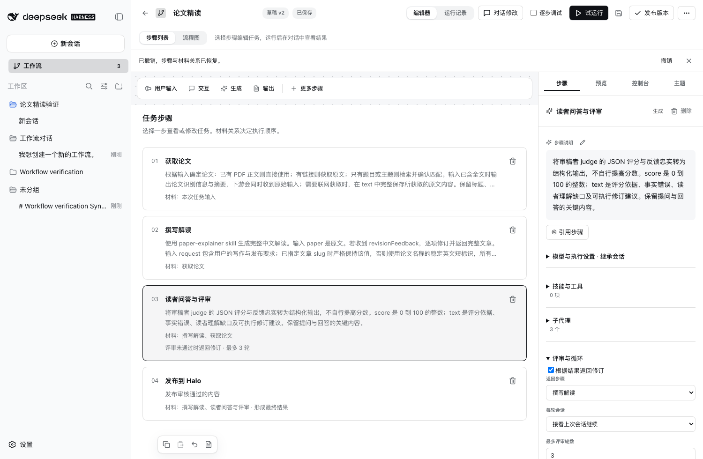
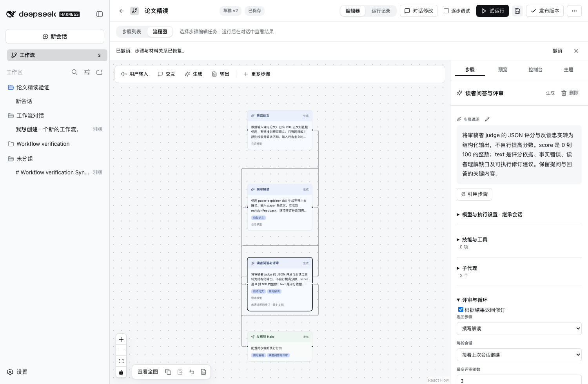

# 步骤编辑与删除验收

2026-09-20

步骤列表提供逐项删除，侧栏提供带文字的删除按钮。Delete 与 Backspace 删除选中步骤，输入框内保留文字编辑行为。删除后选中相邻步骤，提示提供撤销；撤销同步恢复草稿、步骤和材料关系。

添加工具栏占用独立行，滚动内容不会被遮住。侧栏首先显示任务说明，模型、技能与工具、子代理按组展开。流程图提供查看全图操作，采用简洁连线和节点选择反馈。

## 验证

| 场景 | 结果 |
| --- | --- |
| 当前 Desktop 删除新增第五步 | 通过，四个原步骤保留 |
| 保存本地草稿 | 通过，草稿 v4，已发布 v3 保留 |
| 新增后右侧删除 | Web Host 通过 |
| 删除后撤销 | Web Host 通过 |
| 列表直接删除 | Web Host 通过 |
| Delete 删除选中步骤 | Web Host 通过 |
| 切换视图与草稿保留 | Web Host 通过 |
| 更多步骤添加及撤销 | Web Host 通过 |
| 历史续聊与刷新 | Web Host 通过 |
| 明暗主题、窄窗口 | Web Host 检查及截图走查通过 |
| 单元回归 | 50 项通过 |

原右侧垃圾桶按钮在隔离测试与当前 Desktop 均可完成删除；原步骤列表没有直接删除按钮和删除键处理。不能据此确定用户此前每次点击无响应的具体原因。

截图来自隔离 Host 的合成测试。当前 Desktop 私人会话列表未写入仓库。尚未完成读屏软件验收。
